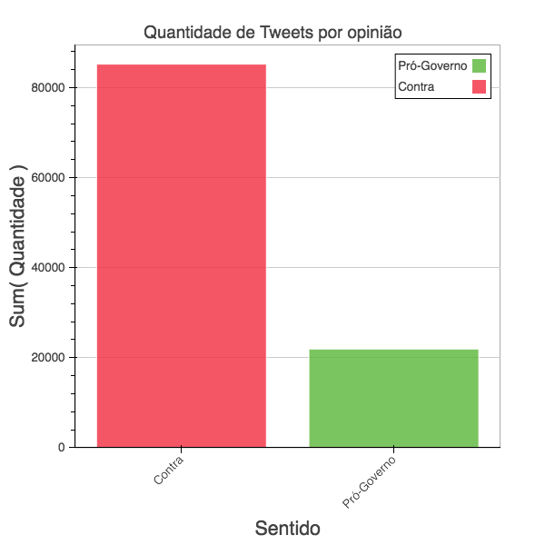

# Data Processing

Biblioteca de códigos úteis(ou não) que foram usados para poderem processar dados de textos e imagens.

As tecnologias aqui usadas são Open-Source e que tem ajuda da comunidade para ser desenvolvida. Entre elas estão, **Python**, **Hadoop**, **NLTK**, **Linux** e algumas outras.

## Projeto #0: Processamento de Textos do Machado de Assis(Abril de 2016 - )

Machado de Assis é um escritor brasileiro que é referência internacional a poesia brasileira. Neste projeto, serão estudados seus textos para analise estatística de palavras, parágrafos, estrofes, versos, sílabas e muitos outros tipos de analises que podem ser feitas a partir de seus textos. Além de ser feita a geração de Hashes e senhas criptográficas a partir de textos do autor.

## Twitter Scrapping: Análise Sentimental! (15 de Abril - 30 de Abril)

Este projeto visa a avaliação do governo atual(até o dia 15 de abril de 2016) com a análise de textos postados na rede social Twitter, limitados a 140 caracteres com Hashtags, mídia e uma série de outros fatores que podem ser extraídos a partir do programa.

E as estátisticas estão disponíveis na imagem abaixo:

